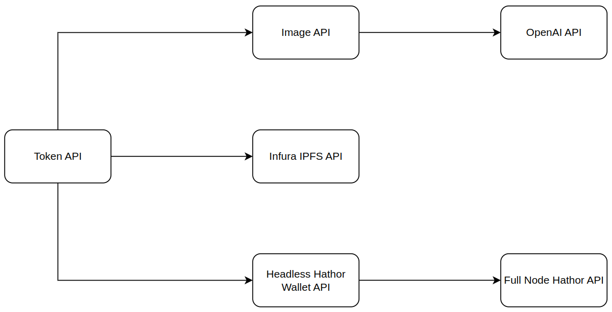

# Webinar Hathor Network

This repository contains the showcase application presented in the 'Hathor Network' webinar. The application consists of two APIs: an Image API that generates images from prompts using OpenAI, and a Token API that creates NFTs by calling the Image API, uploading images to IPFS, and utilizing the Headless Hathor Wallet API.

## Prerequisites

Before getting started, ensure you have the following prerequisites installed:

- Docker: [Install Docker](https://docs.docker.com/get-docker/)
- Node.js: [Install Node.js](https://nodejs.org/)

## Application Overview

The application consists of the following APIs:

1. **Image API**: This API utilizes the OpenAI API to generate images from prompts.
2. **Token API**: This API exposes an endpoint for creating NFTs. The Token API calls the Image API, providing the NFT metadata description as the prompt. It retrieves the generated image and uploads it to IPFS using the Infura IPFS API. Finally, it calls the Hathor Headless Wallet API to create a new NFT.

## Repository Structure

The repository is organized into the following folders:

- **apis**: Contains the "Token API" and "Image API" implementations.
- **scripts**: Provides scripts for setting up the Hathor Wallet Headless using Docker.
- **collections**: Includes Postman collections for interacting with the application.

Feel free to explore each folder for more detailed information.

## Setup Instructions

To set up the project locally, follow these steps:

1. Run the Hathor Headless Wallet and start a wallet.
   - Instructions to start the Headless Hathor Wallet API can be found in the `scripts` directory.

2. Run the Image API.
   - Instructions to start the Image API can be found in the `apis/image-api` directory.

3. Run the Token API.
   - Instructions to start the Token API can be found in the `apis/token-api` directory.

Once the above steps are completed, you will be able to create NFTs with images based on their metadata description.

## Solution Diagram

Below is a diagram illustrating the final solution:

Thank you for your interest in the Hathor Network webinar material! We hope you find them useful.

## License

This project is licensed under the [MIT License](./LICENSE). You are free to use, modify, and distribute this code.
